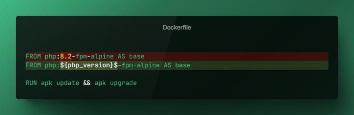

<div align="center">





[](https://www.npmjs.com/package/utpp)

</div>

## Features
- **Universal**: works with any file format
- **Branching**: use if/else logic to include/exclude/modify parts of your file
- **Variables**: use placeholders in your file and replace them with variables
- **Scripting**: execute custom JavaScript code anywhere
- **Portable**: works on any platform (Windows, Linux, MacOS, Docker containers etc.)

## Use Cases
- Dynamically modifiy static config files based on user input
- Replace placeholder with custom eval'd JavaScript on startup
- Start a supervisor service conditionally using docker run arguments. 
- Use different compile commands based on user's current architecture
- and many more...
## Installation

#### Using [npm](https://www.npmjs.com/package/utpp) (recommended)

```
npm install -g utpp
```

or if you want to test it without installing it globally:

```
npx utpp
```

#### Using Precompiled binaries

Precompiled binaries for  **Linux** (x64, alpine) and **Windows** (x64) are published every [release](https://github.com/adrianschubek/utpp/releases).

Both compressed (.tar.gz) and uncompressed binaries are available.

*Linux-alpine* binaries are designed to be used in docker containers.

**MacOS** and *arm* binaries are not published yet, but you can compile them yourself (see below).

#### Compile binaries yourself

1. clone this repo
2. run `npm install`
3. run `npm run build:npm`
4. run `npm run pack`
5. binaries for various platforms are compiled in `/dist`

> Move the executable to `/usr/local/bin` for easier CLI access: `sudo mv <your-file> /usr/local/bin/utpp`

## Usage

```
Universal Text Pre-Processor ('utpp') is a tool for preprocessing any file

Usage: utpp [options] <file> [variables]

Positionals:
  file, f  the file to preprocess                                       [string]

Options:
      --help     Show help                                             [boolean]
      --version  Show version number                                   [boolean]
  -o, --output   the output file                    [string] [default: "stdout"]
  -c, --check    checks/validates the file only       [boolean] [default: false]
  -v, --verbose  makes the preprocessor verbose       [boolean] [default: false]
  -q, --quiet    makes the preprocessor quiet         [boolean] [default: false]
      --no-eval  disables the eval function           [boolean] [default: false]
      --no-vars  disables the variables replacement   [boolean] [default: false]

Examples:
  utpp -o out.txt input.txt    runs the preprocessor on input.txt and write
                               output to out.txt
  utpp input.txt foo=bar       runs the preprocessor on input.txt and sets
                               variable foo to bar
  utpp input.txt -m "<#" "#>"  runs the preprocessor on input.txt and write
                               output to out.txt with markers <# and #>
  utpp -c input.txt            validates the syntax of input.txt file

for more info and support visit https://github.com/adrianschubek/utpp
```
> Show this help page by running `utpp`.

### Syntax

#### Blocks

A (template) block can be declared by using one or more `$[<command>]$` statements where `<command>` is a valid command (see API reference below) and must end in a `$[end]$` statement. 

A block's statements are evaluated from top to bottom. If the result of a command is truthy, the guarded section will be outputted and all other commands in this block ignored. 

Otherwise this statement will be skipped and the next statement is evaluated. If no statement in this block is truthy, the `else` section will be outputted and if no `else` section is present, nothing will be outputted.

There can be any number of blocks declared in a file, but blocks **cannot** be nested.

#### Commands
A command generally follows this syntax `$[<name> [arg1] [arg2] ... [argN]]$` where `<name>` is a [command's name](#commands-reference) `[arg]` is a [*Value*](#values). All commands return either `true` or `false`.

#### Values
- Values can reference Variables by using their name.
- Values are treated as strings by default and cannot contain spaces.
- Values surrounded by `"` are treated as strings and can contain spaces.
- Values surrounded by `` ` `` (backticks) are evaluated using JavaScript's `eval` function. This means you can use any valid JavaScript expression inside.

#### Variables

A variable can be used inside a template block's *Value* by using its name. Variables are stored globally and changes to a variable can only affect statements declared **after** the current one. Outputting a variable can be done using `${<name>}$` (curly braces) where `<name>` is the variable's name.

Variables can be declared on CLI execution using `key=value` pairs or just a `key`. Multiple variables can be passed as arguments by using spaces like `foo=bar foz="baz 123" foobar`.

Custom JavaScript can also be outputted by using backticks. `` foo ${`2 + 2 * 5`}$. `` will output `foo 12.`.

*Example: test.txt*
```
foobar
$[if `1 + 2 == 4`]$
a
$[ifeq foo bar]$
b ${foo}$
$[else]$
c
$[end]$
```

Running this example with `utpp test.txt foo=bar` will result in the following output:
```
foobar
b bar
```


### Commands Reference 

#### Commands without side effects

`if <value>` - return true when `<value>` is truthy, otherwise false.

`ifdef <name>` - return true when a variable with name `<name>` is defined, otherwise false.

`ifndef <name>` - return true when a variable with name `<name>` is not defined, otherwise false.

`ifeq <value1> <value2>` - return true when `<value1>` is equal to `<value2>`, otherwise false.

`ifne <value1> <value2>` - return true when `<value1>` is not equal to `<value2>`, otherwise false.

`iflt <value1> <value2>` - return true when `<value1>` is less than `<value2>`, otherwise false.

`ifgt <value1> <value2>` - return true when `<value1>` is greater than `<value2>`, otherwise false.

`ifge <value1> <value2>` - return true when `<value1>` is greater than or equal to `<value2>`, otherwise false.

`ifle <value1> <value2>` - return true when `<value1>` is less than or equal to `<value2>`, otherwise false.

#### Commands with side effects

`ifdefs <name> <variable> <newvalue>` - return true when a variable with name `<name>` is defined, otherwise false. If the statement is true, `<variable>` will be set to `<newvalue>`.

`ifndefs <name> <variable> <newvalue>` - return true when a variable with name `<name>` is not defined, otherwise false. If the statement is true, `<variable>` will be set to `<newvalue>`.

`ifeqs <value1> <value2> <variable> <newvalue>` - return true when `<value1>` is equal to `<value2>`, otherwise false. If the statement is true, `<variable>` will be set to `<newvalue>`.

`ifnes <value1> <value2> <variable> <newvalue>` - return true when `<value1>` is not equal to `<value2>`, otherwise false. If the statement is true, `<variable>` will be set to `<newvalue>`.

`iflts <value1> <value2> <variable> <newvalue>` - return true when `<value1>` is less than `<value2>`, otherwise false. If the statement is true, `<variable>` will be set to `<newvalue>`.

`ifgts <value1> <value2> <variable> <newvalue>` - return true when `<value1>` is greater than `<value2>`, otherwise false. If the statement is true, `<variable>` will be set to `<newvalue>`.

`ifges <value1> <value2> <variable> <newvalue>` - return true when `<value1>` is greater than or equal to `<value2>`, otherwise false. If the statement is true, `<variable>` will be set to `<newvalue>`.

`ifles <value1> <value2> <variable> <newvalue>` - return true when `<value1>` is less than or equal to `<value2>`, otherwise false. If the statement is true, `<variable>` will be set to `<newvalue>`.

#### Special Commands

`else` - used in a block to define an alternative output when no statement in the block is truthy.	

`end` - used to end a block.

## Roadmap
- [x] no-template option
- [x] include data from other files
- [x] include data from urls
- [ ] custom markers
- [ ] possibility to reference variables inside JavaScript expressions
- [ ] support mutliple files as input and output `utpp . --out-dir out/`

## Development

1. clone this repo
2. run `npm install`
3. run `npm run build:watch` 
4. run `node out/index.js`


<!-- 
any file with 

./tool test.txt --VAR=bla > out.txt

ifeq NAME VALUE
ifne (!=) NAME VALUE
iflt (<) NAME VALUE
ifgt NAME VALUE
ifge NAME VALUE
ifle (<=) NAME VALUE
ifdef NAME
ifndef NAME
else
endif
TODFO: print value echo

VALUE: foo
VALUE: "foo bar"
VALUE: `2+3` (backticks) will be interpreted (eval'd) as javascript

! NO nesting !

--- test.txt
$[ifeqs show bla didShow 1]$
  lol
$[if `1+2 == 5`]$
 aa
$[else]$
  bar
$[end]$

${foo}$ <- variable print

$[if "foo bar"]$

$[end]$

--- alternative same zeile TODO: roadmap

test $[ifeq foo bar]$baz$[end]$ 

$[if 1]$ 
a
$[else]$ 
b
$[end]$ -->